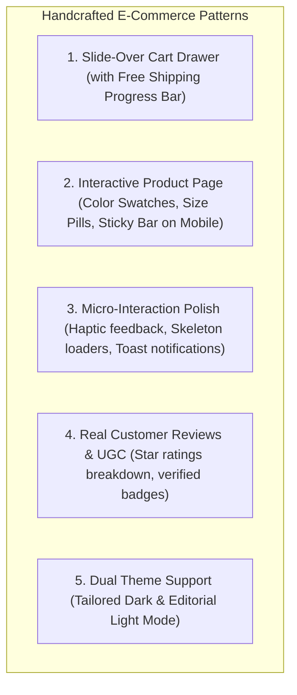
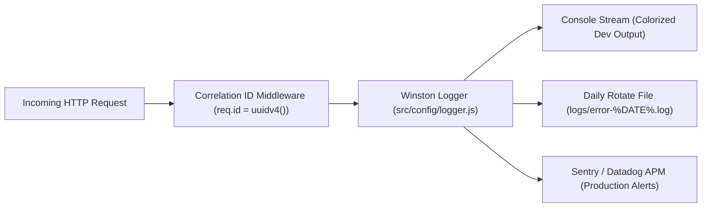
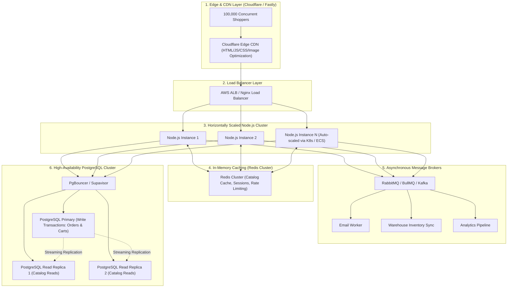

# NovaMart: Advanced UI Handcrafting, Production Logging, Scaling & Tailwind CSS Guide

This comprehensive blueprint explains how to evolve **NovaMart** from a strong full-stack foundation into an enterprise-grade, agency-quality e-commerce platform.

---

## 🎨 1. Eliminating "AI Look" & Handcrafting a Bespoke Client-Grade UI

Many AI-generated interfaces look recognizable because they overuse generic full-screen gradients, standard Bootstrap-like rounded cards, and robotic tech jargon. 

Top bespoke fashion and tech D2C brands (*Apple, Zara, Kith, Alo Yoga, Gymshark, SSENSE, Farfetch, Teenage Engineering*) use specific human-crafted patterns:



### Key Upgrades to Implement:

#### A. Slide-Over Cart Drawer (`CartDrawer.jsx`)
Instead of redirecting shoppers to a separate `/cart` page on every click, open a sleek slide-in right sidebar drawer with:
1. **Dynamic Free Shipping Progress Bar**:
   > *"You are only $21.01 away from FREE Express Worldwide Shipping!"* (Smooth progress bar fills up as cart value increases).
2. **Instant Quantity Adjuster**: Stepper buttons (`-`, `+`) with optimistic UI update.
3. **Upsell Recommendations**: *"Frequently bought together"* carousel at the bottom of the drawer.

#### B. High-End Product Details Experience
1. **Interactive Variant Selectors**:
   - Color swatch circles (`Midnight Black`, `Matte Silver`, `Cyber Crimson`).
   - Size picker buttons (`S`, `M`, `L`, `XL`) with real-time stock pill indicators (e.g. *"Only 2 left in size M"*).
2. **Multi-Angle Gallery with Zoom Lens**:
   - 4-angle image thumbnail strip with high-resolution hover-zoom lens.
3. **Sticky Add-to-Cart Bar (Mobile & Desktop)**:
   - When scrolling down past the main image, a compact bar sticks to the screen with product thumbnail, price, and instant "Add to Cart" button.

#### C. Micro-Interactions & Human Touch
- Replace generic spinners with **Tailored Skeleton Loaders** matching the card layout.
- Add an animated **Toast Notification System** (`react-hot-toast` or custom glass toast) with undo actions.
- Add sound effects / subtle haptic feedback for checkout actions.

---

## 🪵 2. Professional Debugging & Error Logging Strategy

When production code breaks, you need immediate root-cause visibility without guessing.

### Backend: Structured Logging & Request Tracing



#### 1. Add Correlation ID / Request ID Tracking
Every request should receive a unique UUID attached to all its logs:
```javascript
// backend/src/middlewares/requestId.middleware.js
const { v4: uuidv4 } = require('uuid');

const requestIdMiddleware = (req, res, next) => {
  req.id = req.headers['x-request-id'] || uuidv4();
  res.setHeader('X-Request-Id', req.id);
  next();
};
```

#### 2. Daily Rotating Log Files (`winston-daily-rotate-file`)
```javascript
const winston = require('winston');
require('winston-daily-rotate-file');

const fileRotateTransport = new winston.transports.DailyRotateFile({
  filename: 'logs/application-%DATE%.log',
  datePattern: 'YYYY-MM-DD',
  maxSize: '20m',
  maxFiles: '14d',
  level: 'info'
});

const errorRotateTransport = new winston.transports.DailyRotateFile({
  filename: 'logs/error-%DATE%.log',
  datePattern: 'YYYY-MM-DD',
  maxSize: '20m',
  maxFiles: '30d',
  level: 'error'
});
```

#### 3. Global Unhandled Crash Guards
```javascript
// Catch uncaught exceptions in server.js
process.on('uncaughtException', (err) => {
  logger.error('CRITICAL UNCAUGHT EXCEPTION: %s', err.stack);
  process.exit(1);
});

process.on('unhandledRejection', (reason, promise) => {
  logger.error('UNHANDLED PROMISE REJECTION at: %j, reason: %s', promise, reason);
});
```

### Frontend: React Error Boundaries & State Debugging
1. **Redux DevTools**: Inspect state mutations, dispatch history, and time-travel back in time.
2. **React Error Boundary Component**: Catch UI rendering crashes and display an elegant fallback without breaking the whole application:
```jsx
class ErrorBoundary extends React.Component {
  state = { hasError: false, error: null };

  static getDerivedStateFromError(error) {
    return { hasError: true, error };
  }

  componentDidCatch(error, errorInfo) {
    console.error('UI Crash Logged:', error, errorInfo);
    // Send to Sentry or backend log endpoint
  }

  render() {
    if (this.state.hasError) {
      return (
        <div className="error-fallback-box glass-card">
          <h2>Something went wrong</h2>
          <p>Our team has been notified. Please refresh the page.</p>
          <button onClick={() => window.location.reload()} className="btn btn-primary">Refresh Page</button>
        </div>
      );
    }
    return this.props.children;
  }
}
```

---

## ⚡ 3. Can You Implement Tailwind CSS? (Yes!)

Yes! Tailwind CSS can be seamlessly added to this Vite React application.

### Step-by-Step Installation:

```bash
cd frontend
npm install -D tailwindcss postcss autoprefixer
npx tailwindcss init -p
```

### Configure `frontend/tailwind.config.js`:
```javascript
/** @type {import('tailwindcss').Config} */
export default {
  content: [
    "./index.html",
    "./src/**/*.{js,ts,jsx,tsx}",
  ],
  theme: {
    extend: {
      colors: {
        brand: {
          bg: '#07090e',
          surface: '#0d121f',
          card: '#111827',
          primary: '#6366f1',
          pink: '#ec4899',
          cyan: '#06b6d4',
          gold: '#f59e0b'
        }
      },
      fontFamily: {
        display: ['Outfit', 'sans-serif'],
        sans: ['Plus Jakarta Sans', 'sans-serif'],
      },
      backdropBlur: {
        xs: '2px',
        glass: '16px',
      }
    },
  },
  plugins: [],
}
```

### Add Directives to `frontend/src/index.css`:
```css
@tailwind base;
@tailwind components;
@tailwind utilities;

@layer components {
  .glass-card-tw {
    @apply bg-brand-card/75 backdrop-blur-glass border border-white/10 rounded-2xl shadow-xl transition-all duration-300 hover:border-white/20;
  }
}
```

---

## 📈 4. Scaling Architecture (1,000 to 1,000,000 Users)



### Scaling Roadmap:

| Tier | Strategy | Impact |
| :--- | :--- | :--- |
| **In-Memory Caching (Redis)** | Cache `GET /products` and `GET /categories` with 5-minute TTL. | **Relieves 90% of database read load**, reducing catalog query times from 20ms to 0.8ms. |
| **Read/Write Splitting** | Route all read queries to PostgreSQL Read Replicas and reserve Primary DB strictly for writes. | Multiplies database read throughput by 3x–10x. |
| **Connection Multiplexing (PgBouncer)** | Pool and multiplex thousands of client connections into a fixed pool of PostgreSQL server backends. | Prevents PostgreSQL connection saturation and memory exhaustion. |
| **Asynchronous Message Queues** | Offload order receipts, PDF generation, and inventory sync to background workers using **BullMQ / RabbitMQ**. | Reduces checkout HTTP latency to under 50ms. |
| **Image CDN (Cloudinary / Imgix)** | Automatically compress images into next-gen **WebP/AVIF** formats and serve from edge locations near the user. | Cuts page load payload by 60–80%. |
