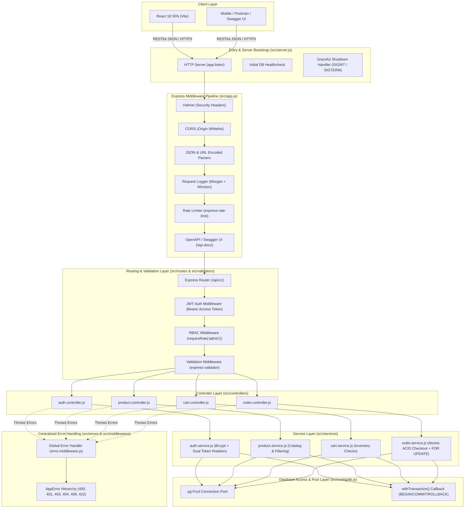
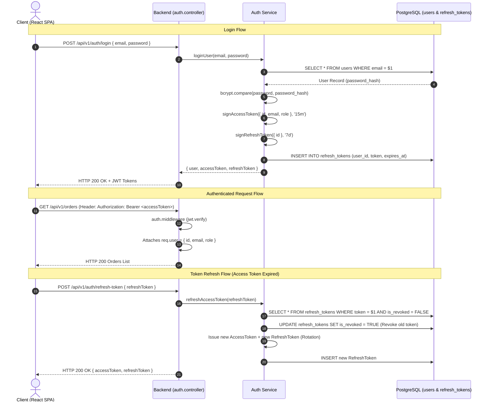
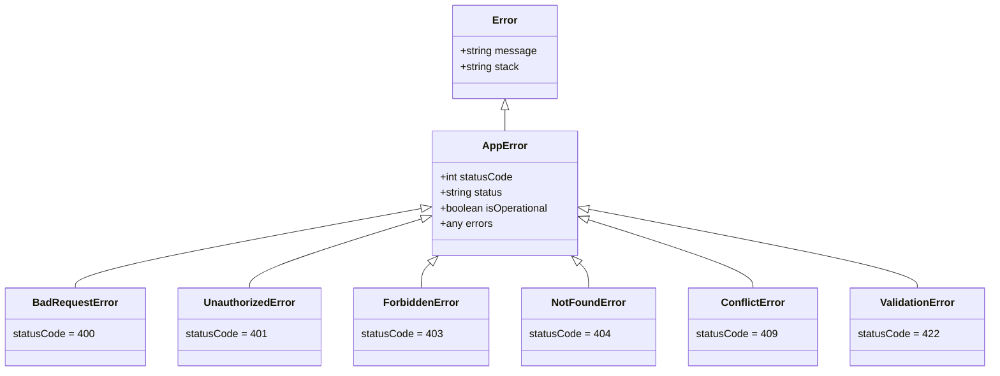

# NovaMart Backend Architecture & Engineering Specification

This document provides a comprehensive, production-grade architectural guide to the **NovaMart** backend service built with **Node.js**, **Express.js**, and **PostgreSQL (Pure Parameterized Raw SQL)**.

---

## 1. High-Level Backend Architecture

NovaMart uses a **Clean Multi-Tier Layered Architecture** adhering to Separation of Concerns (SoC) and Single Responsibility Principle (SRP).



---

## 2. Directory Structure & File Organization

```text
backend/
├── src/
│   ├── config/               # Infrastructure & Environment Configuration
│   │   ├── db.js             # PostgreSQL Pool, query helper & withTransaction
│   │   ├── env.js            # Centralized environment variable validation
│   │   ├── logger.js         # Winston Logger (Debug, Info, Warn, Error streams)
│   │   └── swagger.js        # OpenAPI 3.0 JSDoc specification configuration
│   │
│   ├── constants/            # Immutable Enums & Global Constants
│   │   ├── orderStatus.js    # ('pending', 'processing', 'shipped', 'delivered', 'cancelled')
│   │   └── roles.js          # ('customer', 'admin')
│   │
│   ├── database/             # Database DDL, Migrations & Seeds
│   │   ├── migrate.js        # Schema runner script
│   │   ├── schema.sql        # PostgreSQL tables, constraints, indexes
│   │   └── seed.js           # Sample catalog, categories & demo users
│   │
│   ├── errors/               # Custom AppError Class Hierarchy
│   │   └── AppError.js       # BadRequest, Unauthorized, Forbidden, NotFound, Conflict, ValidationError
│   │
│   ├── middlewares/          # Express Request/Response Middlewares
│   │   ├── auth.middleware.js        # JWT access token extraction and verification
│   │   ├── error.middleware.js       # Centralized 404 and global 500/AppError handler
│   │   ├── rateLimiter.middleware.js # express-rate-limit protection
│   │   ├── requestLogger.middleware.js # HTTP request logging via Morgan + Winston
│   │   ├── role.middleware.js        # Role-Based Access Control (RBAC) guard
│   │   └── validate.middleware.js    # express-validator result formatter (HTTP 422)
│   │
│   ├── validators/           # Request Input Validation Schemas
│   │   ├── auth.validator.js
│   │   ├── cart.validator.js
│   │   ├── order.validator.js
│   │   └── product.validator.js
│   │
│   ├── services/             # Core Business Logic & SQL Transactions
│   │   ├── auth.service.js   # User registration, login, token refresh, logout
│   │   ├── cart.service.js   # Cart items manipulation, stock limit checks
│   │   ├── order.service.js  # Atomic order checkout (FOR UPDATE row locking)
│   │   └── product.service.js# Catalog queries, search, pagination, admin CRUD
│   │
│   ├── controllers/          # HTTP Handlers (Req/Res orchestration)
│   │   ├── auth.controller.js
│   │   ├── cart.controller.js
│   │   ├── order.controller.js
│   │   └── product.controller.js
│   │
│   ├── routes/               # Express Route Declarations with OpenAPI JSDoc
│   │   ├── auth.routes.js    # /api/v1/auth
│   │   ├── cart.routes.js    # /api/v1/cart
│   │   ├── order.routes.js   # /api/v1/orders
│   │   ├── product.routes.js # /api/v1/products
│   │   └── index.js          # Main router aggregator
│   │
│   ├── app.js                # Express Application Builder (middleware pipeline)
│   └── server.js             # HTTP server bootstrap, DB healthcheck & graceful shutdown
│
├── tests/                    # Automated Integration Test Suite (Jest + Supertest)
│   ├── auth.test.js
│   ├── cart.test.js
│   ├── orders.test.js
│   └── products.test.js
│
├── .env.example              # Environment variable documentation template
└── package.json
```

---

## 3. The Middleware Pipeline (Step-by-Step)

Every incoming HTTP request traverses a hardened middleware pipeline configured in [`src/app.js`](file:///c:/Users/chand/OneDrive/Desktop/E-Commerce-Platform/backend/src/app.js):

1. **`helmet()`**: Sets essential HTTP security headers (e.g. `X-Content-Type-Options: nosniff`, `X-Frame-Options: SAMEORIGIN`, `Strict-Transport-Security`, `X-XSS-Protection`).
2. **`cors()`**: Configures Cross-Origin Resource Sharing with whitelisted origins, credentials support (`Access-Control-Allow-Credentials: true`), and standard HTTP methods.
3. **`express.json({ limit: '10mb' })` & `express.urlencoded()`**: Parses incoming JSON request payloads safely with body size limits to prevent memory exhaustion attacks.
4. **`requestLogger`**: Custom stream connecting **Morgan** to **Winston**, recording every incoming method, URL, status code, response time, and payload size.
5. **`globalLimiter` (`express-rate-limit`)**: Prevents DoS and brute-force spam by throttling clients exceeding 100 requests per 15-minute window.
6. **`/api-docs` (`swagger-ui-express`)**: Renders interactive OpenAPI 3.0 documentation.
7. **`/api/v1` (`routes`)**: Dispatches the request to the matching controller.
8. **`notFoundHandler`**: Catches unrouted endpoints and yields a clean `404 Not Found` JSON payload.
9. **`errorHandler`**: Centralized catch-all error handling middleware that captures operational and programmer exceptions.

---

## 4. Authentication & RBAC Architecture

NovaMart uses an **Enterprise Dual-Token JWT Architecture** with **Database Token Rotation**:



### Role-Based Access Control (RBAC):
Protected administrator routes employ the `requireRole('admin')` middleware:
```javascript
const requireRole = (...allowedRoles) => {
  return (req, res, next) => {
    if (!req.user || !allowedRoles.includes(req.user.role)) {
      return next(new ForbiddenError('Forbidden access: insufficient permissions'));
    }
    next();
  };
};
```

---

## 5. Centralized Error Handling System

All application errors inherit from the base [`AppError`](file:///c:/Users/chand/OneDrive/Desktop/E-Commerce-Platform/backend/src/errors/AppError.js) class:



### Consistent JSON Error Response Structure:
```json
{
  "status": "fail",
  "message": "Insufficient stock for 'Wireless Headphones'. Available: 2, requested: 5",
  "errors": null
}
```

---

## 6. Complete API Catalog

| Method | Endpoint | Auth | RBAC | Description |
| :--- | :--- | :---: | :---: | :--- |
| **AUTH** | | | | |
| `POST` | `/api/v1/auth/register` | ❌ | All | Register a new customer account |
| `POST` | `/api/v1/auth/login` | ❌ | All | Authenticate and receive dual JWT tokens |
| `POST` | `/api/v1/auth/refresh-token`| ❌ | All | Rotate refresh token and issue new access token |
| `POST` | `/api/v1/auth/logout` | 🔒 | All | Revoke active refresh token in database |
| `GET` | `/api/v1/auth/me` | 🔒 | All | Retrieve current authenticated user profile |
| **PRODUCTS** | | | | |
| `GET` | `/api/v1/products` | ❌ | All | List products with pagination, search, category & sort |
| `GET` | `/api/v1/products/categories`| ❌ | All | List all product category tags |
| `GET` | `/api/v1/products/:id` | ❌ | All | Get detailed product specifications by ID |
| `POST` | `/api/v1/products` | 🔒 | `admin` | Create a new catalog item |
| `PUT` | `/api/v1/products/:id` | 🔒 | `admin` | Update product details, price, or inventory count |
| `DELETE` | `/api/v1/products/:id` | 🔒 | `admin` | Remove product (soft or hard delete) |
| **CART** | | | | |
| `GET` | `/api/v1/cart` | 🔒 | All | Retrieve current user's shopping cart & subtotal |
| `POST` | `/api/v1/cart/items` | 🔒 | All | Add product to cart (or increment quantity) |
| `PUT` | `/api/v1/cart/items/:id`| 🔒 | All | Update item quantity in cart with inventory check |
| `DELETE` | `/api/v1/cart/items/:id`| 🔒 | All | Remove specific line item from cart |
| `DELETE` | `/api/v1/cart` | 🔒 | All | Clear all items from active cart |
| **ORDERS** | | | | |
| `POST` | `/api/v1/orders` | 🔒 | All | Place order from cart (Atomic SQL transaction + `FOR UPDATE`) |
| `GET` | `/api/v1/orders` | 🔒 | All | List user's order history (or all orders if admin) |
| `GET` | `/api/v1/orders/:id` | 🔒 | All | Retrieve specific itemized order receipt |
| `PATCH` | `/api/v1/orders/:id/status`| 🔒 | `admin` | Update order fulfillment status (`shipped`, `delivered`, etc.) |

---

## 7. Graceful Server Startup & Shutdown

NovaMart implements a resilient zero-downtime startup and teardown process in [`src/server.js`](file:///c:/Users/chand/OneDrive/Desktop/E-Commerce-Platform/backend/src/server.js):

1. **Startup Health Check**: Performs a `SELECT NOW()` query before binding to the HTTP port. If the database is unreachable, warnings are logged while continuing startup.
2. **Graceful Shutdown (`SIGINT` / `SIGTERM`)**:
   - Stops accepting new HTTP connections via `server.close()`.
   - Waits for existing in-flight requests to complete.
   - Drains and closes the PostgreSQL pool via `db.pool.end()`.
   - Forces termination after a 10-second safety timeout if hanging connections persist.
