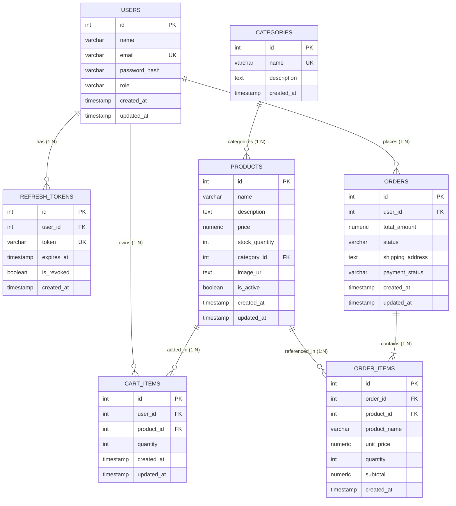

# NovaMart E-Commerce Database Architecture & Technical Specification

This document provides a comprehensive, production-grade technical breakdown of the database layer powering the **NovaMart** full-stack e-commerce platform.

---

## 1. Database Engine & Technology Choice

| Attribute | Specification |
| :--- | :--- |
| **Database Engine** | **PostgreSQL** (Relational Database Management System - RDBMS) |
| **SQL Philosophy** | **Pure Parameterized Raw SQL** (No ORM overhead; maximum performance, full query control, and explicit ACID transactions) |
| **Node.js Driver** | `pg` (`node-postgres`) Connection Pool with automatic client lifecycle management |
| **Transaction Isolation Level** | `READ COMMITTED` with explicit **Pessimistic Row-Level Locking** (`SELECT ... FOR UPDATE`) |
| **Connection Pooling** | Configurable thread pool (`max: 20`, `idleTimeoutMillis: 30000`, `connectionTimeoutMillis: 2000`) |

### Why PostgreSQL with Raw Parameterized SQL?
1. **ACID Compliance**: Ensures atomic checkouts, zero overselling, and guaranteed consistency under concurrent checkout traffic.
2. **Deterministic Query Performance**: Eliminates ORM query generation bottlenecks, N+1 query surprises, and hidden JOIN latency.
3. **Pessimistic Row-Level Locking (`FOR UPDATE`)**: Prevents inventory overselling race conditions when multiple customers buy the same limited-stock item simultaneously.
4. **Parameterized Queries ($1, $2, ...)**: Complete protection against SQL Injection attacks at the driver protocol layer.

---

## 2. System Architecture & Backend Integration Flow

NovaMart implements a **Strict Clean Layered Architecture**:

```mermaid
flowchart TD
    Client["Client (React SPA / Mobile / REST Client)"]
    
    subgraph Express_Backend ["Express.js Backend Layer"]
        Router["Express Router (/api/v1)"]
        AuthMW["Auth & RBAC Middleware (JWT Verification)"]
        Validator["Input Validation Middleware (express-validator)"]
        Controller["Controller Layer (HTTP Request/Response mapping)"]
        Service["Service Layer (Business Logic & Transactions)"]
    end
    
    subgraph Data_Access_Layer ["Database Access & Pool Layer (src/config/db.js)"]
        Pool["pg.Pool (Connection Pool)"]
        ClientWorker["Dedicated PoolClient (BEGIN / COMMIT / ROLLBACK)"]
    end
    
    subgraph PostgreSQL_Engine ["PostgreSQL Relational Engine"]
        Engine["PostgreSQL 14+ Server (Port 5432/5433)"]
        CatalogTables["users | products | categories | cart_items | orders | order_items | refresh_tokens"]
    end

    Client -->|HTTP / JSON| Router
    Router --> AuthMW
    AuthMW --> Validator
    Validator --> Controller
    Controller --> Service
    Service -->|db.query() / db.withTransaction()| Pool
    Pool --> ClientWorker
    ClientWorker -->|TCP Socket Connection| Engine
    Engine --> CatalogTables
```

### Connection Lifecycle & Management (`src/config/db.js`)
- **Connection Pool**: A global pool is initialized once when the Node.js server starts.
- **Non-blocking Queries**: `db.query(text, params)` leases a connection from the pool, executes the query, and instantly releases the client back to the pool.
- **Managed Atomic Transactions (`withTransaction`)**:
  ```javascript
  const withTransaction = async (callback) => {
    const client = await pool.connect();
    try {
      await client.query('BEGIN');
      const result = await callback(client);
      await client.query('COMMIT');
      return result;
    } catch (error) {
      await client.query('ROLLBACK');
      throw error;
    } finally {
      client.release(); // Always release client back to pool
    }
  };
  ```

---

## 3. Entity-Relationship (ER) Model Design

The schema follows strict **Third Normal Form (3NF)** rules to eliminate data redundancy and preserve relational integrity.



---

## 4. Complete Schema & DDL Specification

### Table 1: `users`
Stores user identity, hashed credentials, and Role-Based Access Control (`customer`, `admin`).
```sql
CREATE TABLE IF NOT EXISTS users (
    id SERIAL PRIMARY KEY,
    name VARCHAR(100) NOT NULL,
    email VARCHAR(255) UNIQUE NOT NULL,
    password_hash VARCHAR(255) NOT NULL,
    role VARCHAR(20) NOT NULL DEFAULT 'customer' CHECK (role IN ('admin', 'customer')),
    created_at TIMESTAMP WITH TIME ZONE DEFAULT CURRENT_TIMESTAMP,
    updated_at TIMESTAMP WITH TIME ZONE DEFAULT CURRENT_TIMESTAMP
);
```

### Table 2: `refresh_tokens`
Dual-token JWT session tracking with token rotation, revocation on logout, and replay attack defense.
```sql
CREATE TABLE IF NOT EXISTS refresh_tokens (
    id SERIAL PRIMARY KEY,
    user_id INT NOT NULL REFERENCES users(id) ON DELETE CASCADE,
    token VARCHAR(500) NOT NULL UNIQUE,
    expires_at TIMESTAMP WITH TIME ZONE NOT NULL,
    is_revoked BOOLEAN DEFAULT FALSE,
    created_at TIMESTAMP WITH TIME ZONE DEFAULT CURRENT_TIMESTAMP
);
```

### Table 3: `categories`
Hierarchical product classification taxonomy.
```sql
CREATE TABLE IF NOT EXISTS categories (
    id SERIAL PRIMARY KEY,
    name VARCHAR(100) NOT NULL UNIQUE,
    description TEXT,
    created_at TIMESTAMP WITH TIME ZONE DEFAULT CURRENT_TIMESTAMP
);
```

### Table 4: `products`
Core product catalog with live stock tracking, price constraints, and category linkage.
```sql
CREATE TABLE IF NOT EXISTS products (
    id SERIAL PRIMARY KEY,
    name VARCHAR(255) NOT NULL,
    description TEXT,
    price NUMERIC(10, 2) NOT NULL CHECK (price >= 0),
    stock_quantity INT NOT NULL DEFAULT 0 CHECK (stock_quantity >= 0),
    category_id INT REFERENCES categories(id) ON DELETE SET NULL,
    image_url TEXT,
    is_active BOOLEAN DEFAULT TRUE,
    created_at TIMESTAMP WITH TIME ZONE DEFAULT CURRENT_TIMESTAMP,
    updated_at TIMESTAMP WITH TIME ZONE DEFAULT CURRENT_TIMESTAMP
);
```

### Table 5: `cart_items`
User shopping cart items with a composite unique constraint preventing duplicate rows per product.
```sql
CREATE TABLE IF NOT EXISTS cart_items (
    id SERIAL PRIMARY KEY,
    user_id INT NOT NULL REFERENCES users(id) ON DELETE CASCADE,
    product_id INT NOT NULL REFERENCES products(id) ON DELETE CASCADE,
    quantity INT NOT NULL DEFAULT 1 CHECK (quantity > 0),
    created_at TIMESTAMP WITH TIME ZONE DEFAULT CURRENT_TIMESTAMP,
    updated_at TIMESTAMP WITH TIME ZONE DEFAULT CURRENT_TIMESTAMP,
    CONSTRAINT unique_user_product_cart UNIQUE (user_id, product_id)
);
```

### Table 6: `orders`
Order header capturing totals, lifecycle fulfillment status, and delivery address.
```sql
CREATE TABLE IF NOT EXISTS orders (
    id SERIAL PRIMARY KEY,
    user_id INT NOT NULL REFERENCES users(id) ON DELETE CASCADE,
    total_amount NUMERIC(10, 2) NOT NULL CHECK (total_amount >= 0),
    status VARCHAR(30) NOT NULL DEFAULT 'pending' CHECK (status IN ('pending', 'processing', 'shipped', 'delivered', 'cancelled')),
    shipping_address TEXT NOT NULL,
    payment_status VARCHAR(30) NOT NULL DEFAULT 'paid',
    created_at TIMESTAMP WITH TIME ZONE DEFAULT CURRENT_TIMESTAMP,
    updated_at TIMESTAMP WITH TIME ZONE DEFAULT CURRENT_TIMESTAMP
);
```

### Table 7: `order_items`
Immutable line-item breakdown snapshot preserving the historical unit price and product name at the exact time of order placement.
```sql
CREATE TABLE IF NOT EXISTS order_items (
    id SERIAL PRIMARY KEY,
    order_id INT NOT NULL REFERENCES orders(id) ON DELETE CASCADE,
    product_id INT NOT NULL REFERENCES products(id) ON DELETE RESTRICT,
    product_name VARCHAR(255) NOT NULL,
    unit_price NUMERIC(10, 2) NOT NULL CHECK (unit_price >= 0),
    quantity INT NOT NULL CHECK (quantity > 0),
    subtotal NUMERIC(10, 2) NOT NULL CHECK (subtotal >= 0),
    created_at TIMESTAMP WITH TIME ZONE DEFAULT CURRENT_TIMESTAMP
);
```

---

## 5. Foreign Key Cascading & Referential Integrity Rules

| Relationship | Constraint | On Delete Behavior | Business Rationale |
| :--- | :--- | :--- | :--- |
| `refresh_tokens.user_id` -> `users.id` | Foreign Key | `ON DELETE CASCADE` | Removing a user immediately deletes all active tokens. |
| `cart_items.user_id` -> `users.id` | Foreign Key | `ON DELETE CASCADE` | Removing a user clears their active cart. |
| `cart_items.product_id` -> `products.id` | Foreign Key | `ON DELETE CASCADE` | Removing a product removes it from all active carts. |
| `products.category_id` -> `categories.id` | Foreign Key | `ON DELETE SET NULL` | Deleting a category keeps products in the catalog under uncategorized. |
| `orders.user_id` -> `users.id` | Foreign Key | `ON DELETE CASCADE` | Orders belong to the user account hierarchy. |
| `order_items.order_id` -> `orders.id` | Foreign Key | `ON DELETE CASCADE` | Deleting an order purges its constituent line items. |
| `order_items.product_id` -> `products.id` | Foreign Key | `ON DELETE RESTRICT` | **Critical**: Prevents deleting a catalog product if historical paid orders reference it. |

---

## 6. Performance Indexing Strategy

B-Tree indexes are deployed on all high-frequency filter, join, and foreign key columns:

```sql
-- Identity & Auth Lookups
CREATE INDEX IF NOT EXISTS idx_users_email ON users(email);
CREATE INDEX IF NOT EXISTS idx_refresh_tokens_token ON refresh_tokens(token);
CREATE INDEX IF NOT EXISTS idx_refresh_tokens_user ON refresh_tokens(user_id);

-- Catalog Filtering & Sorting
CREATE INDEX IF NOT EXISTS idx_products_category ON products(category_id);
CREATE INDEX IF NOT EXISTS idx_products_price ON products(price);
CREATE INDEX IF NOT EXISTS idx_products_active ON products(is_active);

-- Shopping Cart & Order History
CREATE INDEX IF NOT EXISTS idx_cart_items_user ON cart_items(user_id);
CREATE INDEX IF NOT EXISTS idx_orders_user ON orders(user_id);
CREATE INDEX IF NOT EXISTS idx_orders_status ON orders(status);
CREATE INDEX IF NOT EXISTS idx_order_items_order ON order_items(order_id);
```

---

## 7. High-Concurrency Atomic Checkout Flow (`FOR UPDATE`)

To eliminate race conditions (such as two users attempting to purchase the last available item simultaneously), NovaMart executes checkout inside an isolated PostgreSQL transaction using **Pessimistic Row-Level Locking**:

```sql
-- Step 1: Lock product rows exclusively for this transaction
SELECT id, name, price, stock_quantity, is_active
FROM products
WHERE id IN ($1, $2)
FOR UPDATE;

-- Step 2: Validate stock_quantity >= requested_quantity in memory

-- Step 3: Insert Order header
INSERT INTO orders (user_id, total_amount, status, shipping_address, payment_status)
VALUES ($1, $2, 'pending', $3, 'paid')
RETURNING id;

-- Step 4: Insert Order Line Items & Decrement Inventory
INSERT INTO order_items (order_id, product_id, product_name, unit_price, quantity, subtotal)
VALUES ($1, $2, $3, $4, $5, $6);

UPDATE products
SET stock_quantity = stock_quantity - $1
WHERE id = $2;

-- Step 5: Clear user's cart
DELETE FROM cart_items WHERE user_id = $1;

-- Step 6: COMMIT (releases all locked product rows)
```

---

## 8. Database Healthcheck & Diagnostics

The backend includes a built-in healthcheck query via [`src/config/db.js`](file:///c:/Users/chand/OneDrive/Desktop/E-Commerce-Platform/backend/src/config/db.js):

```sql
SELECT NOW() AS now, current_database() AS db;
```

When called, it returns:
```json
{
  "status": "healthy",
  "database": "ecommerce_db",
  "timestamp": "2026-10-07T04:24:46.119Z"
}
```
