# Complete Deployment Guide: NovaMart E-Commerce Platform

This guide provides step-by-step instructions for deploying the **NovaMart** full-stack application (React SPA + Node.js/Express + PostgreSQL) to production across various cloud environments.

---

## 🏗️ Deployment Architecture Options

```mermaid
flowchart TD
    subgraph Option_1 ["Option 1: Modern Cloud PaaS (Recommended / Free Tier Available)"]
        O1_FE["Frontend: Vercel / Netlify (Global CDN)"]
        O1_BE["Backend: Render.com / Railway.app (Node Web Service)"]
        O1_DB["Database: Neon.tech / Supabase / Render PostgreSQL"]
        O1_FE -->|HTTPS REST| O1_BE
        O1_BE -->|SSL TCP Wire Protocol| O1_DB
    end

    subgraph Option_2 ["Option 2: Containerized Docker Compose (VPS / AWS EC2 / DigitalOcean)"]
        O2_FE["Frontend Container (Nginx:alpine Port 80/443)"]
        O2_BE["Backend Container (Node:18 Port 5000)"]
        O2_DB["PostgreSQL Container (Postgres:15-alpine)"]
        O2_FE -->|Docker Network| O2_BE
        O2_BE -->|Docker Network| O2_DB
    end
```



---

## 🚀 Option 1: Cloud PaaS (Vercel + Render + Neon / Supabase)

*Best for fast deployments with zero server maintenance, automatic HTTPS, and global CDN caching.*

### Step 1: Deploy PostgreSQL Database (Neon or Supabase)
1. Go to [Neon.tech](https://neon.tech) or [Supabase.com](https://supabase.com) and create a free PostgreSQL project.
2. Note your connection string parameters:
   - `Host`: `ep-xxxx.us-east-2.aws.neon.tech`
   - `Port`: `5432`
   - `User`: `your_user`
   - `Password`: `your_password`
   - `Database`: `neondb` (or `postgres`)
3. **Run Schema Migration on Cloud DB**:
   From your local terminal, point `.env` temporarily to the remote database and run:
   ```bash
   cd backend
   npm run migrate
   npm run seed
   ```
   *(Your cloud PostgreSQL database is now fully populated with tables, categories, sample products, and demo accounts).*

---

### Step 2: Deploy Backend to Render.com (or Railway)
1. Push your code to a GitHub/GitLab repository.
2. Log in to [Render.com](https://render.com) and click **New +** ➔ **Web Service**.
3. Connect your repository and configure the service:
   - **Name**: `novamart-backend`
   - **Root Directory**: `backend`
   - **Environment**: `Node`
   - **Build Command**: `npm install`
   - **Start Command**: `npm start`
4. Add **Environment Variables** in Render Dashboard:
   | Key | Value |
   | :--- | :--- |
   | `NODE_ENV` | `production` |
   | `PORT` | `5000` |
   | `DB_HOST` | `your-cloud-db-host.neon.tech` |
   | `DB_PORT` | `5432` |
   | `DB_USER` | `your_db_user` |
   | `DB_PASSWORD` | `your_db_password` |
   | `DB_NAME` | `neondb` |
   | `JWT_ACCESS_SECRET` | `generate_a_random_64_character_secret_string` |
   | `JWT_REFRESH_SECRET`| `generate_another_random_64_character_secret_string` |
   | `JWT_ACCESS_EXPIRATION` | `15m` |
   | `JWT_REFRESH_EXPIRATION`| `7d` |
   | `CORS_ORIGIN` | `https://your-frontend-domain.vercel.app` |
5. Click **Deploy Web Service**.
6. Copy your live backend URL (e.g. `https://novamart-backend.onrender.com`).

---

### Step 3: Deploy Frontend to Vercel (or Netlify)
1. Log in to [Vercel.com](https://vercel.com) and click **Add New** ➔ **Project**.
2. Select your repository and set the configuration:
   - **Framework Preset**: `Vite`
   - **Root Directory**: `frontend`
   - **Build Command**: `npm run build`
   - **Output Directory**: `dist`
3. Add **Environment Variable**:
   | Key | Value |
   | :--- | :--- |
   | `VITE_API_BASE_URL` | `https://novamart-backend.onrender.com/api/v1` |
4. Click **Deploy**.
5. Vercel automatically deploys the SPA with the included [`vercel.json`](file:///c:/Users/chand/OneDrive/Desktop/E-Commerce-Platform/frontend/vercel.json) rewrite rule for client-side routing.

---

## 🐳 Option 2: Docker Compose (VPS / AWS EC2 / DigitalOcean Droplet)

*Best for self-hosting everything on a single virtual server ($4–$10/month).*

### Step 1: Provision a Linux VPS (Ubuntu 22.04 LTS)
1. Launch an Ubuntu VPS instance on AWS EC2, DigitalOcean, Linode, or Hetzner.
2. Install Docker and Docker Compose:
   ```bash
   sudo apt update && sudo apt install -y docker.io docker-compose-v2
   sudo systemctl enable --now docker
   ```

### Step 2: Clone & Configure
```bash
git clone https://github.com/your-username/E-Commerce-Platform.git
cd E-Commerce-Platform
```

Create a production `.env` in the root folder:
```env
DB_USER=postgres
DB_PASSWORD=SecureProductionPassword123!
DB_NAME=ecommerce_db
DB_PORT=5432
JWT_ACCESS_SECRET=your_super_secret_access_key_12345
JWT_REFRESH_SECRET=your_super_secret_refresh_key_67890
CORS_ORIGIN=http://your-server-ip,https://yourdomain.com
```

### Step 3: Build & Launch with Docker Compose
```bash
docker compose up -d --build
```

### Step 4: Run Initial Database Migration & Seed
Run migration scripts inside the running backend container:
```bash
docker exec -it novamart_backend npm run migrate
docker exec -it novamart_backend npm run seed
```

- **Frontend App**: `http://your-server-ip` (Port 80)
- **Backend API**: `http://your-server-ip:5000/api/v1`
- **Swagger Docs**: `http://your-server-ip:5000/api-docs`

---

## 🔒 Production Checklist & SSL Setup

1. **Free SSL Certificate (Let's Encrypt / Certbot)**:
   If using a custom domain on your VPS:
   ```bash
   sudo apt install -y certbot python3-certbot-nginx
   sudo certbot --nginx -d yourdomain.com -d api.yourdomain.com
   ```
2. **CORS Security**: Ensure `CORS_ORIGIN` in backend matches your exact frontend production domain.
3. **Strong JWT Secrets**: Generate 256-bit cryptographic secrets:
   ```bash
   node -e "console.log(require('crypto').randomBytes(64).toString('hex'))"
   ```
4. **Healthcheck Verification**: Test `https://your-api-domain.com/api/v1/products` to ensure full end-to-end database connectivity.
