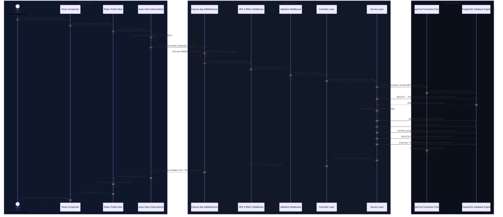
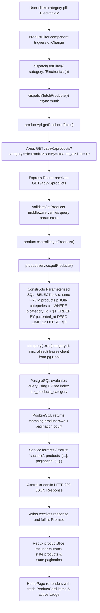
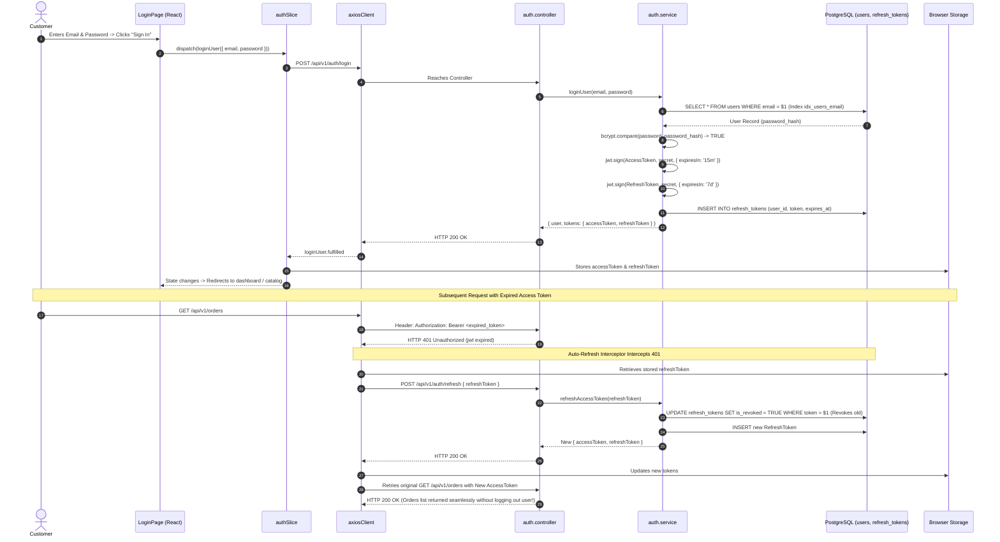
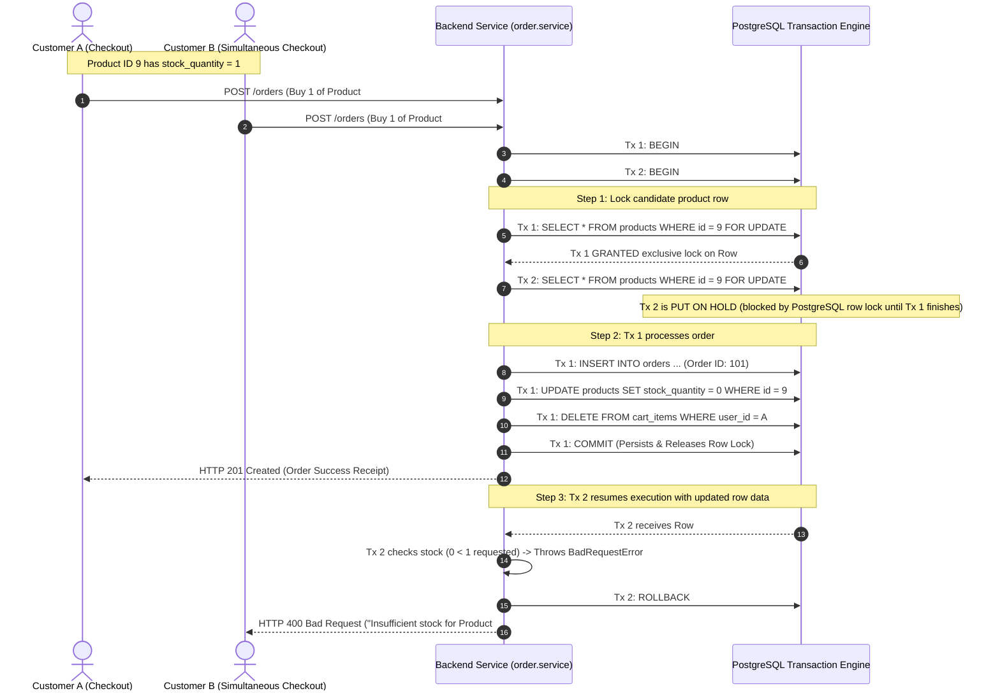
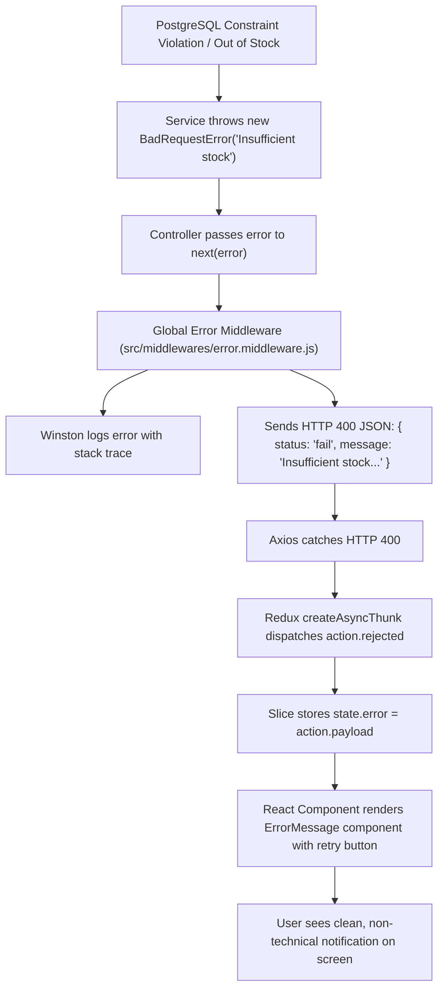

# Complete End-to-End System Flow: Frontend ➔ REST APIs ➔ Backend ➔ Database

This document provides a comprehensive end-to-end architectural walkthrough detailing how data and control flows across all four tiers of the **NovaMart** e-commerce platform:

```
[ FRONTEND (React + Redux) ] 
             ▲
             │ (JSON / HTTP)
             ▼
[ REST API INTERFACE (Axios + Interceptors) ] 
             ▲
             │ (TCP / HTTP REST)
             ▼
[ BACKEND (Express + Middlewares + Controllers + Services) ] 
             ▲
             │ (pg Connection Pool / TCP Socket)
             ▼
[ DATABASE (PostgreSQL Engine + Raw SQL + ACID Transactions) ]
```

---

## 1. Master System Flowchart



---

## 2. Deep-Dive Flow 1: Product Catalog Browsing & Live Filtering

When a user opens the catalog, searches for an item, or clicks a category tag (`Electronics`, `Clothing`):



---

## 3. Deep-Dive Flow 2: Authentication & Dual-Token Rotation

When a user logs in and later makes authenticated calls:



---

## 4. Deep-Dive Flow 3: Atomic Checkout (`SELECT ... FOR UPDATE`)

How NovaMart guarantees that concurrent purchases of a limited-stock item never cause race condition overselling:



---

## 5. End-to-End Error Propagation & Recovery

When an operational failure occurs anywhere in the stack:



---

## 6. Tier Communication Protocol Summary

| Tier Boundary | Protocol | Format | Security & Transport |
| :--- | :--- | :--- | :--- |
| **Frontend ➔ REST API** | HTTP/1.1 or HTTP/2 | JSON payloads (`application/json`) | HTTPS + Bearer JWT Header + CORS Whitelist |
| **Express Middleware ➔ Controller** | Node.js In-Memory | JavaScript `Request` & `Response` objects | Memory references + `express-validator` sanitizer |
| **Controller ➔ Service** | Node.js In-Memory | Async Function Call with DTOs | Strict Separation of Concerns |
| **Service ➔ PostgreSQL** | PostgreSQL TCP Wire Protocol | Raw Parameterized SQL (`$1, $2`) | `pg` Connection Pool + TCP Keepalive + SSL (Prod) |
