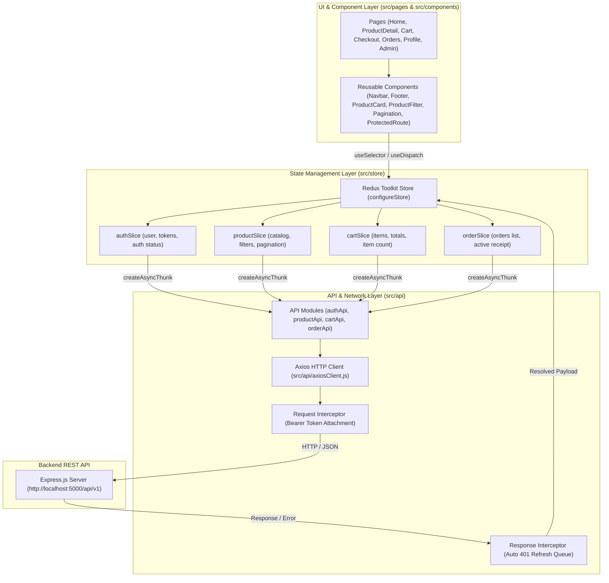
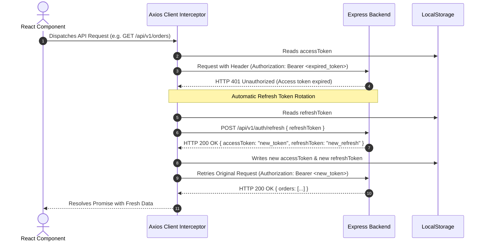

# NovaMart Frontend Architecture & Technical Specification

This document provides a comprehensive, production-grade technical manual on the frontend application powering the **NovaMart** modern e-commerce marketplace built with **React 18**, **Redux Toolkit**, **React Router v6**, **Vite**, and **Vanilla Glassmorphic CSS**.

---

## 1. High-Level Frontend Architecture

NovaMart Frontend is structured as a **Predictable State Container SPA (Single Page Application)** with unidirectional data flow:



---

## 2. Directory Structure & File Breakdown

```text
frontend/
├── src/
│   ├── api/                      # Network & HTTP Layer
│   │   ├── axiosClient.js        # Configured Axios instance with auto-refresh interceptors
│   │   ├── authApi.js            # Authentication endpoints (login, register, refresh, logout)
│   │   ├── cartApi.js            # Cart endpoints (get, add, update, remove, clear)
│   │   ├── orderApi.js           # Order placement, order history, admin status updates
│   │   └── productApi.js         # Catalog fetching, filtering, admin product CRUD
│   │
│   ├── components/               # Modular Reusable React Components
│   │   ├── common/               # Global components (Navbar, Footer, Pagination, ProtectedRoute)
│   │   │   ├── Navbar.jsx & Navbar.css       # Sticky header with announcement marquee & category rail
│   │   │   ├── Footer.jsx & Footer.css       # Marketplace footer with links, trust badges & payment chips
│   │   │   ├── Pagination.jsx                # Accessible page navigator
│   │   │   ├── ProtectedRoute.jsx            # Auth & RBAC role-guard wrapper
│   │   │   └── LoadingSpinner.jsx            # Animated loading spinners & error states
│   │   │
│   │   └── products/             # Catalog components
│   │       ├── ProductCard.jsx   # Product card with wishlist, ratings, discount badges & quick add
│   │       ├── ProductFilter.jsx # Category pill bar, price range inputs, sort dropdown
│   │       └── Products.css      # Catalog & card styling
│   │
│   ├── pages/                    # View Routes
│   │   ├── HomePage.jsx          # Editorial billboard, category tiles, countdown, catalog, reviews
│   │   ├── ProductDetailPage.jsx # High-res product view, stock counter, quantity adjuster
│   │   ├── LoginPage.jsx         # Customer & Admin login with 1-click quick demo fill
│   │   ├── RegisterPage.jsx      # Customer registration
│   │   ├── CartPage.jsx          # Shopping cart overview, quantity controls & subtotal
│   │   ├── CheckoutPage.jsx      # Shipping address form & atomic order placement
│   │   ├── OrdersPage.jsx        # Order history with itemized breakdown & status badges
│   │   ├── ProfilePage.jsx       # User profile overview, lifetime statistics & role badge
│   │   ├── AdminDashboardPage.jsx# Admin metrics, product catalog management, order fulfillment
│   │   ├── NotFoundPage.jsx      # 404 error page
│   │   └── Pages.css             # Page-level styles
│   │
│   ├── store/                    # Redux Toolkit Global State
│   │   ├── slices/
│   │   │   ├── authSlice.js      # Auth lifecycle, user state, token management
│   │   │   ├── cartSlice.js      # Cart items, item counts, subtotal calculation
│   │   │   ├── orderSlice.js     # Orders history, order creation, receipt tracking
│   │   │   └── productSlice.js   # Products list, filters (search, price, sort), pagination
│   │   └── store.js              # Store configuration with root reducer
│   │
│   ├── styles/                   # Design tokens & global variables
│   │   └── index.css             # Obsidian & electric neon theme, fonts, button & card utilities
│   │
│   ├── __tests__/                # Automated Unit & Component Tests (Jest + RTL)
│   │   ├── authSlice.test.js
│   │   ├── CartItem.test.jsx
│   │   ├── Navbar.test.jsx
│   │   └── ProductCard.test.jsx
│   │
│   ├── App.jsx                   # Route declarations & route guards
│   ├── main.jsx                  # React DOM bootstrap with Redux Provider & BrowserRouter
│   └── index.html                # HTML entry with Outfit & Plus Jakarta Sans typography
```

---

## 3. State Management Architecture (Redux Toolkit)

NovaMart employs **Redux Toolkit (RTK)** to maintain clean, immutable, and normalized state.

### Redux Slices Overview:

| Slice | Managed State | Key Async Thunks |
| :--- | :--- | :--- |
| **`authSlice`** | `user`, `accessToken`, `refreshToken`, `isAuthenticated`, `isLoading`, `error` | `loginUser`, `registerUser`, `logoutUser`, `fetchCurrentUser` |
| **`productSlice`** | `products`, `currentProduct`, `categories`, `pagination`, `filters` (`search`, `category`, `minPrice`, `maxPrice`, `sortBy`), `isLoading`, `error` | `fetchProducts`, `fetchProductById`, `fetchCategories`, `createProduct`, `updateProduct`, `deleteProduct` |
| **`cartSlice`** | `items`, `totalItems`, `totalAmount`, `isLoading`, `error` | `fetchCart`, `addToCart`, `updateCartItem`, `removeFromCart`, `clearCart` |
| **`orderSlice`** | `orders`, `currentOrder`, `latestReceipt`, `isLoading`, `error` | `createOrder`, `fetchOrders`, `fetchOrderById`, `updateOrderStatus` |

---

## 4. Advanced Network Layer & Auto-Refresh Token Interceptor

All HTTP communication passes through a single centralized Axios instance [`src/api/axiosClient.js`](file:///c:/Users/chand/OneDrive/Desktop/E-Commerce-Platform/frontend/src/api/axiosClient.js):



### Concurrent Request Queuing:
If multiple API requests fail simultaneously due to an expired access token, `axiosClient` prevents redundant refresh calls by buffering all failed requests into an in-memory `failedQueue`, resolving them all once the single refresh operation finishes.

---

## 5. Client-Side Routing & Route Guards (`ProtectedRoute`)

Routing is managed via **React Router DOM v6** in [`src/App.jsx`](file:///c:/Users/chand/OneDrive/Desktop/E-Commerce-Platform/frontend/src/App.jsx):

```jsx
// Customer Protected Route
<Route
  path="/checkout"
  element={
    <ProtectedRoute>
      <CheckoutPage />
    </ProtectedRoute>
  }
/>

// Admin Protected Route
<Route
  path="/admin"
  element={
    <ProtectedRoute requiredRole="admin">
      <AdminDashboardPage />
    </ProtectedRoute>
  }
/>
```

### `ProtectedRoute` Guard Logic:
1. **Unauthenticated Check**: If `isAuthenticated === false`, redirects to `/login` while preserving the intended target path via `state={{ from: location }}`.
2. **Role Verification**: If `requiredRole="admin"` is required and `user.role !== 'admin'`, redirects to `/` (Home).
3. **Authorized**: Renders the protected page component.

---

## 6. Design System & Aesthetics (Vanilla CSS)

The design system is implemented in [`src/index.css`](file:///c:/Users/chand/OneDrive/Desktop/E-Commerce-Platform/frontend/src/index.css) without heavy utility framework overhead:

- **Typography**: Google Fonts pairing: **Outfit** (high-impact display titles, buttons, badges) + **Plus Jakarta Sans** (clean, legible body text).
- **Color Palette**: Deep Obsidian backdrop (`#07090e`), Slate surfaces (`#111827`), Electric Indigo (`#6366f1`), Neon Pink (`#ec4899`), Cyan (`#06b6d4`), and Emerald (`#10b981`).
- **Glassmorphism**: `.glass-card` uses `backdrop-filter: blur(16px)` with ultra-fine border highlights `rgba(255, 255, 255, 0.1)`.
- **Micro-Animations**: Hover zoom effects (`scale(1.08)`), pulse glows (`pulseGlow`), and smooth layout transitions (`0.25s cubic-bezier(0.4, 0, 0.2, 1)`).

---

## 7. Frontend Testing Strategy

Tests are built with **Jest** and **React Testing Library (RTL)** in [`src/__tests__`](file:///c:/Users/chand/OneDrive/Desktop/E-Commerce-Platform/frontend/src/__tests__):
- **Redux Slice Unit Tests**: Verifies synchronous and asynchronous state reducer transformations.
- **Component Unit Tests**: Verifies that badges, stock levels, prices, and error boundaries render accurately under different Redux state mock conditions.
- **Interactive User Event Tests**: Tests cart quantity modification, search input typing, and button clicks.
