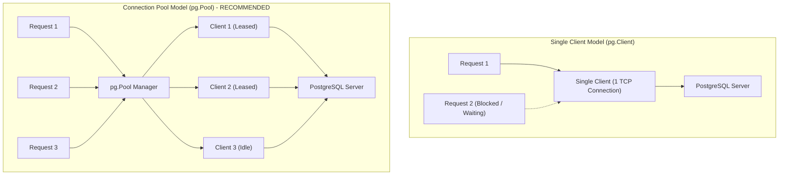

# Complete Guide: Connecting Node.js with PostgreSQL (Raw SQL & Connection Pooling)

This guide provides a comprehensive, production-ready tutorial and architectural manual on connecting **Node.js** to **PostgreSQL** using the official `pg` (`node-postgres`) library.

---

## 1. Fundamentals: `pg.Client` vs `pg.Pool`

When connecting Node.js to PostgreSQL, the `pg` package provides two distinct connection models:



| Feature | `pg.Client` (Single Connection) | `pg.Pool` (Connection Pooling) |
| :--- | :--- | :--- |
| **Concurrency** | **Single-threaded**: Queries must run sequentially on the same TCP socket. | **High Concurrency**: Automatically leases connections to simultaneous requests. |
| **Connection Cost** | Establishing a new TCP handshake on every HTTP request adds 20–80ms latency. | Maintains warm, persistent connections. Query execution starts immediately (<1ms). |
| **Failure Recovery** | If the connection drops, manual reconnection logic is required. | Automatically heals, removes bad clients, and creates new connections. |
| **Use Case** | One-off CLI scripts, schema migration scripts. | **Web APIs, Express servers, and microservices (Standard).** |

---

## 2. Step-by-Step Connection Setup

### Step 1: Install Dependencies
```bash
npm install pg dotenv
```

### Step 2: Configure Environment Variables (`.env`)
Create a `.env` file in the project root:
```env
# Server Port
PORT=5000
NODE_ENV=development

# PostgreSQL Connection Credentials
DB_HOST=localhost
DB_PORT=5432
DB_USER=postgres
DB_PASSWORD=your_secure_password
DB_NAME=ecommerce_db

# Connection Pool Tuning
DB_MAX_CONNECTIONS=20
DB_IDLE_TIMEOUT_MILLIS=30000
DB_CONNECTION_TIMEOUT_MILLIS=2000
```

---

## 3. Production Database Module Implementation (`src/config/db.js`)

Below is the exact production-ready database module used in NovaMart:

```javascript
// src/config/db.js
const { Pool } = require('pg');
require('dotenv').config();

// 1. Initialize the PostgreSQL Connection Pool
const pool = new Pool({
  host: process.env.DB_HOST || 'localhost',
  port: parseInt(process.env.DB_PORT, 10) || 5432,
  user: process.env.DB_USER || 'postgres',
  password: process.env.DB_PASSWORD,
  database: process.env.DB_NAME || 'ecommerce_db',
  max: parseInt(process.env.DB_MAX_CONNECTIONS, 10) || 20, // Max concurrent connections
  idleTimeoutMillis: parseInt(process.env.DB_IDLE_TIMEOUT_MILLIS, 10) || 30000, // Close idle clients after 30s
  connectionTimeoutMillis: parseInt(process.env.DB_CONNECTION_TIMEOUT_MILLIS, 10) || 2000, // Fail fast if pool is full
  
  // For Cloud / Hosted Databases (AWS RDS, Neon, Supabase, Render, Heroku):
  // ssl: process.env.NODE_ENV === 'production' ? { rejectUnauthorized: false } : false
});

// 2. Pool Lifecycle Event Listeners
pool.on('connect', () => {
  console.log('[DEBUG]: New PostgreSQL client connected to the pool');
});

pool.on('error', (err) => {
  console.error('[ERROR]: Unexpected error on idle PostgreSQL client', err);
});

/**
 * 3. Generic Query Execution Helper
 * Automatically acquires a client, executes the parameterized SQL query, and releases the client.
 *
 * @param {string} text - SQL Query String (e.g. 'SELECT * FROM users WHERE id = $1')
 * @param {Array} params - Array of parameter values (e.g. [userId])
 * @returns {Promise<import('pg').QueryResult>}
 */
const query = async (text, params = []) => {
  const start = Date.now();
  try {
    const res = await pool.query(text, params);
    const duration = Date.now() - start;
    console.log(`[SQL Query] Executed in ${duration}ms | Rows: ${res.rowCount}`);
    return res;
  } catch (error) {
    console.error(`[SQL Error] ${error.message} | Query: ${text}`);
    throw error;
  }
};

/**
 * 4. Dedicated Transaction Helper
 * Manages full ACID Transaction lifecycle (BEGIN -> Operations -> COMMIT / ROLLBACK -> RELEASE).
 *
 * @param {Function} callback - Async function receiving the leased client
 * @returns {Promise<any>}
 */
const withTransaction = async (callback) => {
  const client = await pool.connect();
  try {
    await client.query('BEGIN');
    const result = await callback(client);
    await client.query('COMMIT');
    return result;
  } catch (error) {
    await client.query('ROLLBACK');
    throw error;
  } finally {
    client.release(); // CRITICAL: Guarantees client returns to pool
  }
};

/**
 * 5. Database Healthcheck
 * Verifies live connection to the database.
 */
const checkHealth = async () => {
  try {
    const result = await pool.query('SELECT NOW() AS now, current_database() AS db');
    return {
      status: 'healthy',
      database: result.rows[0].db,
      timestamp: result.rows[0].now
    };
  } catch (error) {
    return {
      status: 'unhealthy',
      error: error.message
    };
  }
};

module.exports = {
  pool,
  query,
  withTransaction,
  checkHealth
};
```

---

## 4. Query Execution Patterns & Parameterized SQL

### Pattern A: Single Row Fetch
```javascript
const getUserById = async (id) => {
  const res = await db.query(
    'SELECT id, name, email, role FROM users WHERE id = $1',
    [id]
  );
  return res.rows[0] || null;
};
```

### Pattern B: Multi-Row Query with Pagination & Sorting
```javascript
const getProducts = async ({ categoryId, limit = 10, offset = 0 }) => {
  const queryText = `
    SELECT p.id, p.name, p.price, p.stock_quantity, c.name AS category_name
    FROM products p
    LEFT JOIN categories c ON p.category_id = c.id
    WHERE ($1::INT IS NULL OR p.category_id = $1)
    ORDER BY p.created_at DESC
    LIMIT $2 OFFSET $3
  `;
  const res = await db.query(queryText, [categoryId || null, limit, offset]);
  return res.rows;
};
```

### Pattern C: Inserting Data with `RETURNING *`
In PostgreSQL, the `RETURNING` clause instantly returns the newly generated auto-incrementing ID and row without needing a second query:
```javascript
const createUser = async (name, email, passwordHash) => {
  const res = await db.query(
    `INSERT INTO users (name, email, password_hash)
     VALUES ($1, $2, $3)
     RETURNING id, name, email, role, created_at`,
    [name, email, passwordHash]
  );
  return res.rows[0];
};
```

---

## 5. Security: Preventing SQL Injection

Parameterized queries pass SQL commands and user inputs to PostgreSQL across **separate protocol channels**. The database engine compiles the SQL string first, making SQL injection mathematically impossible.

| ❌ Dangerous (Vulnerable to SQL Injection) | ✅ Secure (Parameterized SQL) |
| :--- | :--- |
| `db.query("SELECT * FROM users WHERE email = '" + req.body.email + "'")` | `db.query('SELECT * FROM users WHERE email = $1', [req.body.email])` |
| If `req.body.email = "' OR '1'='1"`, all user records are exposed! | The string `"' OR '1'='1"` is safely treated as a literal email value. |

---

## 6. Atomic Transactions with Row-Level Locking (`FOR UPDATE`)

To execute atomic multi-step operations (such as checking stock and creating an order without race conditions), use `withTransaction`:

```javascript
const checkout = async (userId, cartItems, shippingAddress) => {
  return await db.withTransaction(async (client) => {
    // 1. Lock product rows exclusively for this transaction
    const productIds = cartItems.map(i => i.product_id);
    const placeholders = productIds.map((_, idx) => `$${idx + 1}`).join(',');
    
    const productsRes = await client.query(
      `SELECT id, name, price, stock_quantity 
       FROM products 
       WHERE id IN (${placeholders}) 
       FOR UPDATE`,
      productIds
    );

    // 2. Validate stock levels in memory
    for (const item of cartItems) {
      const product = productsRes.rows.find(p => p.id === item.product_id);
      if (product.stock_quantity < item.quantity) {
        throw new Error(`Insufficient stock for ${product.name}`);
      }
    }

    // 3. Create the order header
    const orderRes = await client.query(
      `INSERT INTO orders (user_id, total_amount, shipping_address)
       VALUES ($1, $2, $3)
       RETURNING id`,
      [userId, 199.99, shippingAddress]
    );
    const orderId = orderRes.rows[0].id;

    // 4. Decrement inventory
    for (const item of cartItems) {
      await client.query(
        `UPDATE products SET stock_quantity = stock_quantity - $1 WHERE id = $2`,
        [item.quantity, item.product_id]
      );
    }

    // 5. Clear cart
    await client.query('DELETE FROM cart_items WHERE user_id = $1', [userId]);

    return { orderId, status: 'success' };
  });
};
```

---

## 7. Production Best Practices Checklist

1. **Always Release Leased Clients**: When manually acquiring a client with `pool.connect()`, always place `client.release()` inside a `finally` block to prevent connection starvation.
2. **Tune Pool Limits for Your Server**: Set `max: 20` for standard container environments. Setting it too high (>100) will exhaust PostgreSQL server RAM.
3. **Use SSL in Production**: When connecting to cloud providers (AWS RDS, Supabase, Neon, Render), enable SSL:
   ```javascript
   ssl: process.env.NODE_ENV === 'production' ? { rejectUnauthorized: false } : false
   ```
4. **Implement Graceful Shutdown**: Close the pool before the Node process exits:
   ```javascript
   process.on('SIGTERM', async () => {
     await pool.end();
     process.exit(0);
   });
   ```
